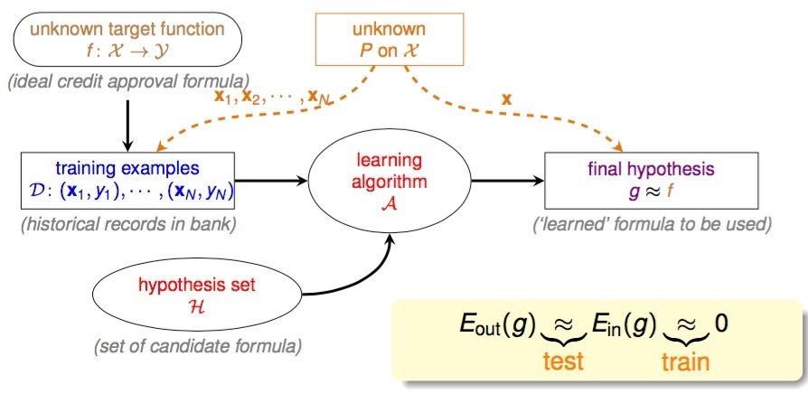

# Model Component

* **A**lgorithm, learning algorithm 為挑選假說的演算法
* **D**ata Set, D: {(**X**1,Y1), (**X**2,Y2), ... (**X**N,YN)}
* **X** 為 input 的特徵向量, Y 為 Output
* **H**ypothesis Set, 推論 input: **X** 與 output: Y 之間存在關係的假說集合
* **f** 理想上的 target function 可以完全地反應出所有的關係 (實際上 unknown), f: **X** → Y
* **g** 透過 algorithm 從 hypothesis set 中挑選出最接近 f 者
* **A** takes **D** and **H** to get **g** ≈ **f**, 機器學習是透過資料從假說中挑選最接近目標函式者, 用以推測訓練資料以外的其他資料結果
* Learning Model = **A** and **H**

透過以上的 Learning Model, 看起來我們好像真的有個系統可以幫助我們學習到一些可量化評估的事情 (當然, 上面的模型其實我們還有很多的細節並未描述到)。

> **Machine Learning vs Data Mining**

> 資料探勘通常是對大量的資料中尋找有用的性質, 如果這個性質的目標是找出更好的 hypothesis, 則兩者的差異不大 或是 可相互幫忙。

> **Machine Learning vs Artificial Intelligence**

> 人工智慧的目標在於經過計算之後可以得到具備智能的行為, 而機器學習是其中一種實現人工智慧的方法 (其他方法像是 決策數)。

> **Machine Learning vs Statistics**

> 統計學是用資料推論一些未知的結果, 所以統計是機器學習中會使用到的其中一種工具。