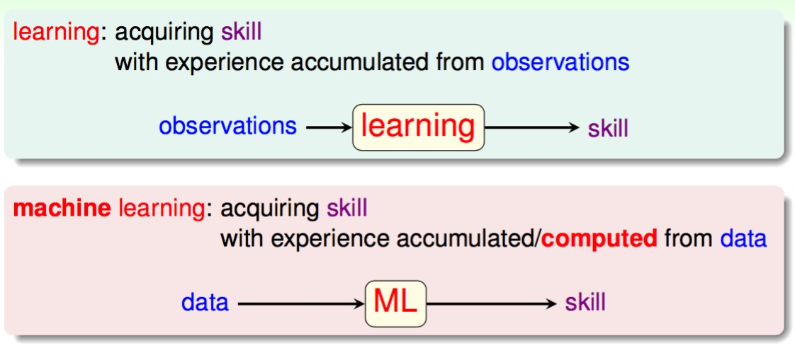

# When Can Machine Learn?

什麼是學習? 什麼又是機器學習?

模仿人類學習的方式, 透過觀察 (data) 學習 (取出特徵、經過計算處理) 後得到有意義的技巧 (提升某項可以量化評估的表現)。

##### 一些應用機器學習的時機
* 過於複雜 (不預期的狀況) 的系統不容易轉化成程式來處理
* 不容易寫出判定規則的系統
* 人尚未或無法即時判定的行為
* 過分客製化 (數量過多) 的反應

##### 使用條件
* 具備 可理解的特徵 以及 可供量化評估改進的結果
* 不容易定義出規則 (容易定義則使用規則撰寫一般的程式處理即可)
* 有資料可供學習