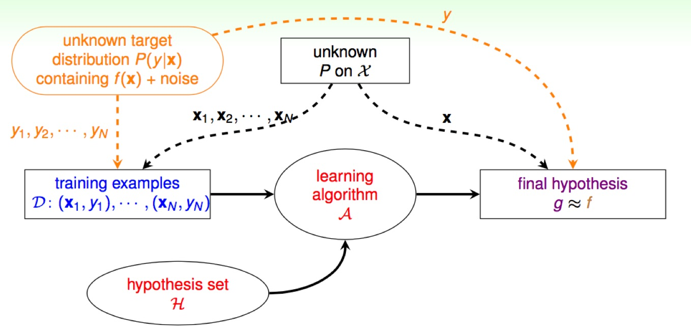

# Noise and Error

在先前的課程, 我們知道當 **D**ata 中存在 noise 時, 我們仍可以使用 Pocket Algorithm ... etc 來處理, 但這邊要探討的是當 noise 存在時, 對我們之前所推導的定理是否會有影響?

### Deterministic v.s Probabilistic

**Deterministic**

之前數學推導的假設前提是 **x**n ~ P and yn = f (**x**n), 假設目標函數的存在

**Probabilistic**

但今天我們不再將 y 的產生是透過目標函數 f 來, 而是透過 Target Distribution 的機率函數 P(y|**x**) 取得 (解讀為當 **x** 發生時, y 發生的機率), 在這樣的前提底下, VC bound 仍具有類似的效果 (課程沒有證明)。

**Goal of Learing**

Predict ideal mini-target (w.r.t P(y|**x**)) on often-seen input (w.r.t P(**x**)), 學習的目標在於從常見的 input 裡, 得到使錯誤發生的機率最低, 可以理解為追求 mini-target 的同時就是在使 $$E_{in}$$ 降低。

# Error Measure
使用 err 來表示 pointwise 的錯誤評估函數
 
* in-sample: $$E_{in}(g) = \frac{1}{N} \sum_{n=1}^{N} err(g(x_n), f(x_n))$$, (沒有 noise 的話, $$f(x_n) = y_n$$)
* out-sample: $$E_{out} = \epsilon \ error(g(x), f(x))$$, (x~P, x 同是機率分佈 P)

Two important Pointwise Error Measures
* 0/1 error, $$err(\widetilde{y}, y) = |\widetilde{y} \ne y|$$ => minimum 'flipping noise'
* squared error, $$err(\widetilde{y}, y) = (\widetilde{y} - y)^2$$ => minimum Gaussian noise

> 使用不同的 err, 會造成最後的 mini-target 挑選到不同的 $$\widetilde{y}$$

# Choice of Error Measure
應用在不同場合底下, 對於錯誤的容忍也會給於不同的權重, 並非每種誤判都具有相同的代價。最好的方式是我們知道使用者心裡想要的 $$err$$, 使用它來求出 f, 但這通常很難做到, 所以退而求其次使用 $$\hat{err}$$ 代表一種已知的錯誤評估方式來評估 (**plausible**), 又或者我們找得是一個好作最佳化的演算法, 很容易的可以改善我們要的結果 (**friendly**)。

###以 Binary Classification 為例

使用 0/1 error 列舉 $$y_n$$ 與 $$h(x)$$ (2x2 )的組合不同權重, 稱作 Cost Matrix