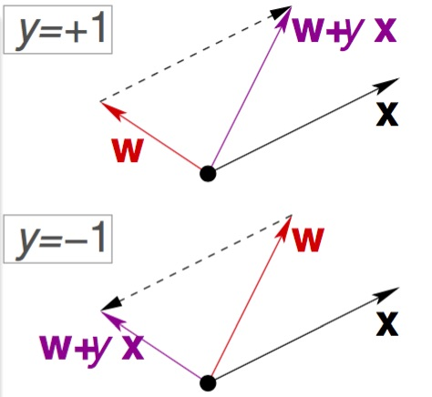

0
## Perceptron Learning Algorith## Perceptron Learning Algorithm
在開始用數學工具幫助我們理解為何可以學習前, 這裡先介紹一種簡單的機器學習演算法, 並在後續透過這個例子來加入數學工具分析 Machine Learning 的限制。

首先介紹一組 Hypothesis Set 的定義方式稱作 **Perceptron** 來求一個是非題的解, 數學上的符號如下

令 **x** 為 d 維度的 input, **w** 為 d 維度的權重值

**H**ypothesis Set = {**w**1, **w**2, ... **w**∞}

Σ (i=1~d) wixi (再定義出一個 threshold 來二分這是非題的結果, y = {+1 , -1})

h(x) = sign ( Σ (i=1~d) wixi - threshold ) 

令 w0 為 -threshold、x0 為 1, 則化簡如下

h(x) = sign ( Σ (i=0~d) wixi ) = sign (**w**T**x**)

> 相當於取 w 與 x 兩個 d+1 維的向量內積。

目標是從 **H**ypothesis Set 中挑選出最接近 f 的 g, 而這最接近的定義為在已經看過的資料中可以產出愈相同的 output , 但實際上整個 H 是一個無限大的集合, 所以 **PLA** (Perceptron Learning Algorithm) 的想法是嘗試先從中挑選出第一個 g0 (或稱 **w**0), 並不斷的在錯誤中修正。

### 演算法

If, sign (**w**T**x**n(t)) ≠ yn(t)

> hypothesis 計算的結果於資料中的不符, yn(t) = {+1,-1}

Let, **w**t+1 = **w**t + yn(t) **x**n(t)

> 如果預期結果是正時, 因內積的兩個向量夾角過大才會是負, 所以修正方式是要往 **x** 方向靠近, 反之則要遠離 **x**

Until no more mistakes.

(以二維(2D)的 input 為例做想像)