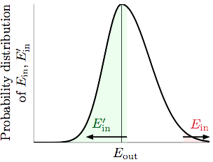

# Vapnik-Chervonenkis (VC) bound

$$
\mathbb{P}_\mathcal{D}[BAD\ D]\leq 2\cdot2m_{\mathcal{H}}(2 \cdot N)\cdot exp(-2 \cdot \frac{1}{16} \epsilon ^2N)
$$
這個章節要將 **壞事情發生的機率** 給出更為嚴謹的不等式 (上式) 來 bound 住。

## Proof

$$
\mathbb{P}[\exists h \in H s.t. | E_{in}(h) - E_{out}(h) > \epsilon]
$$
壞事情發生的機率實際上還存在一個 ∞ 個的變因, 那就是 $$E_{out}$$, 所以第一步我們要先替換掉 $$E_{out}$$, 這邊假設的是我們做驗證的時候, **D**ata 不再從無限大的 outside 取了, 而是從我們的另一組 N 個 input 的 **D'ata** 去取, 而由於 D' 與 D 都是相同的機率分佈的 Sample, 所以當我們今天取得 $$E_{in}$$ 離 $$E_{out}$$ 很遠時, 有超過 $$\frac{1}{2}$$ 以上的機會離 $$E'_{in}$$很遠 (如下圖示)

$$
\frac{1}{2}\mathbb{P}[\exists h \in H \ s.t. | E_{in}(h) - E_{out}(h) > \epsilon] \le \mathbb{P}[\exists h \in H \ s.t. | E_{in}(h) - E'_{in}(h) > \frac{\epsilon}{2}]
$$
代換之後的不等式如上, 嚴謹數學證明參考自 [beader.me](http://beader.me/mlnotebook/section2/vc-dimension-two.html)

$$
\mathbb{P}_\mathcal{D}[BAD\ D]\le 2 \cdot \mathbb{P}[\exists h \in H \ s.t. | E_{in}(h) - E'_{in}(h) > \frac{\epsilon}{2}]
$$

