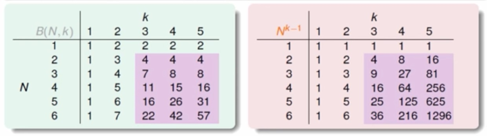

# VC Dimensio# VC Dimension
VC Dimension ($$V_{dc}$$) = 'minimum K' -1

$$
\begin{aligned}
\\m_{\mathcal{H}}(N)\leq \sum_{i=0}^{d_{vc}}\binom {N}{i}\leq N^{d_{vc}} \\\
\textit{( for }N\geq 2, d_{vc}\geq 2\textit{ )}
\end{aligned}
$$
透過上圖可以簡化我們的式子
$$
\begin{aligned}
&\;\;\;\,\mathbb{P}[|E_{in}(g) - E_{out}(g)\gt \epsilon|] \\\
&= \mathbb{P}[BAD]\\\
&\leq \mathbb{P}[\exists h \in \mathcal{H}\text{ s.t. } |E_{in}(h)-E_{out}(h)|\gt \epsilon] \\\
&\leq 4m_{\mathcal{H}}(2N)exp(-\frac{1}{8}\epsilon^2N) \\\
&\leq 4(2N)^{d_{vc}}exp(-\frac{1}{8}\epsilon^2N) \\\
&\textit{( if }d_{vc}\textit{ is finite = k is exists)}
\end{aligned}
$$

## 機器學習的條件
* Good Hypothesis Set (有 Break Point)
* Good Data (N 夠大)
* Good Algorithm (可以挑到夠小 $$E_{in}$$ 的 Hypothesis)
* Good Luck

## VC Dimension for d-D Perceptron 
* 1-D perceptron: $$d{vc} = 2$$
* 2-D perceptron: $$d{vc} = 3$$
* d-D perceptron: $$d{vc} =^? d + 1$$

### Proof

##### Step 1. 證明 $$d_{vc} \ge d+1$$
> 證明的方式就是要證明當 **x** 為 d 維度時, d + 1 個 output 可以被 shattered

設計一個特殊矩陣, 表示將 d+1 個 input 組成一個 **X** 矩陣 (**X** 反矩陣存在 **invertible**)
$$
X =
 \left[
 \begin{matrix}
   - x_1^T - \\
   - x_2^T - \\
   - x_3^T - \\
   : \\
   - x_{d+1}^T - 
 \end{matrix}
 \right]
 =
 \left[
 \begin{matrix}
   1&0&0&...&0 \\
   1&1&0&...&0 \\
   1&0&1&...&0 \\
   &&:&& \\
   1&0&0&...&1 \\
 \end{matrix}
 \right]
$$
根據定義

For any **y**, sign (**Xw**) = **y**, 那我們試著找一個 **w** 使得 **Xw** = **y** (假設存在這麼剛好的 **X**)

由前提知設計出的**X** 反矩陣存在, 所以 **w** = **X-1y** 也會存在, 得證存在某個 hypothesis **w** 使得任意 **y** 都可以被產生出來 (Shattered)。

##### Step 2. 證明 $$d_{vc} \le d+1$$
> 證明的方式就是要證明當 **x** 為 d 維度時, d + 2 個以上的 output 都不能被 shattered

將之前設計的矩陣加入第 d+2 筆的 input
$$
X =
 \left[
 \begin{matrix}
   - x_1^T - \\
   - x_2^T - \\
   - x_3^T - \\
   : \\
   - x_{d+1}^T - \\
   - x_{d+2}^T - 
 \end{matrix}
 \right]
$$
則 因為線性相依的關係 (d+1 維, 且 前 d+1 筆資料是線性獨立, 第 d+2 筆肯定能由前 d+1 筆向量組合而成)

$$x_{d+2} = a_1x_1 + a_2x_2 + ... + a_{d+1}x_{d+1}$$

假設 d+2 種 output 都能被 shattered 的話, 那麼 d+1 種的 output 也要能被 shattered, 所以此時我們假設存在 **w** 可以使得 $$sign(a_n) = sign(w^Tx_n)$$, 因為與係數同向也僅是其中一種 output y (Shatter 理應要存在)

$$w^Tx_{d+2} = a_1w^Tx_1 + a_2w^Tx_2 + ... + a_{d+1}w^Tx_{d+1} \gt 0$$ (恆成立)

所以至少有一種是無法被產生出來的 output, 那就是以上的 case 搭配上 $$y_{d+2}$$ < 0 (反證法得證)。

## Homework 補充
[證明參考](http://beader.me/mlnotebook/section2/vc-dimension-three.html)

$$d_{vc}(\cup_{k=1}^{K}\mathcal{H}_k) = d_{vc}(\mathcal{H}_1)+d_{vc}(\mathcal{H}_2)+ K - 1$$

## 複雜度評估
$$
\begin{aligned}
\mathbb{P}[BAD] &= \mathbb{P}[\exists h \in \mathcal{H}\text{ s.t. } |E_{in}(h)-E_{out}(h)|\gt \epsilon] \\\
&\leq 4m_{\mathcal{H}}(2N)exp(-\frac{1}{8}\epsilon^2N)
\end{aligned}
$$將右式定義為 $$\delta$$, 移項可得 $$\epsilon = \sqrt{\frac{8}{N}ln(\frac{4(2N)^{d_{vc}}}{\delta})}$$

$$E_{in}(g)-\sqrt{\frac{8}{N}ln(\frac{4(2N)^{d_{vc}}}{\delta})} \leq E_{out}(g) \leq E_{in}(g)+\sqrt{\frac{8}{N}ln(\frac{4(2N)^{d_{vc}}}{\delta})}$$

重新定義 $$\Omega (N,\mathcal{H},\delta) = 上式的\ \sqrt{...}\ 項$$, 稱作 Penalty for Model Complexity