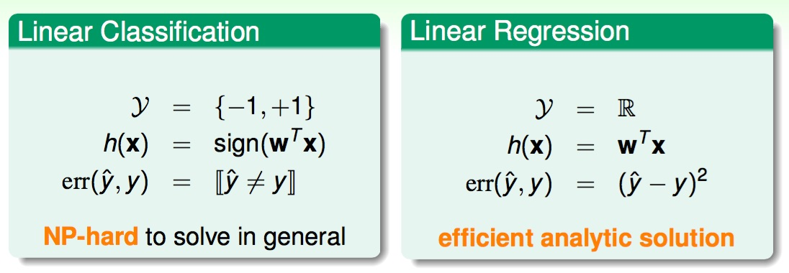
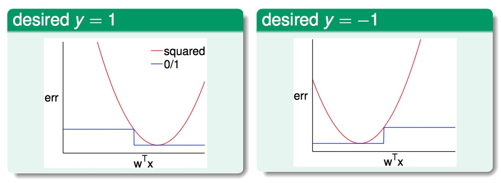

# Linear Classification vs. Linear Regression

今天 Linear Classification 的問題, 我們在介紹 PLA 的時候有提到是 NP-hard, 但是今天 y output {-1,+1} 也都是 ∈ $$\mathbb{R}$$, 那我們是否能夠拿解 Linear Regression 的演算法來做 Linear Classification 的問題呢?

## Yes!
從兩者錯誤的衡量方式來觀察 $$\color{blue}{err_{0/1} = \left[ sign(w^\intercal x) \ne y \right]}$$ , $$\color{red}{err_{sqr} = (w^\intercal x) - y)^2}$$

$$
\begin{aligned}
\text{classification} E_{out} &\overset{VC}{\le} \text{classification}\ E_{in} + \text{Penalty for Model Complexity}\\\
&\le \text{regression}\ E_{in} + \text{Penalty for Model Complexity}
\end{aligned}
$$
