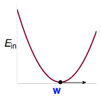
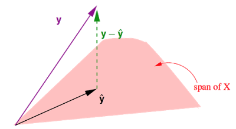
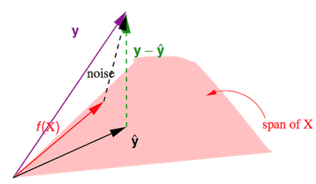

# Linear Regression

Linear Regression 討論的問題在於 output 是屬於 $$\mathbb{R}$$ 實數空間

Linear Regression 的 Hypothesis (這僅是其中一種 H 的設計方式)

$$h(x)=\sum_{i={0}}^d w_ix_i= w^Tx$$

問題可以想像成是在求出一條/高維平面, 當 **x** 代入時可以與 $$y_n$$ 愈接近。 (紅色標出的距離稱作 residuals 餘數)

這邊 Error Measure 是使用這個問題傳統上常用的 **Squared**
$$
\begin{matrix}
err(\hat{y}_n,y_n) = (\hat{y}_n-y_n)^2
\end{matrix}
$$
我們可以得到 in-sample
$$
E_{in}(w)=\frac{1}{N}\sum_{n=1}^N(\hat{y}_n - y_n)^2=\frac{1}{N}\sum_{n=1}^N(w^Tx_n-y_n)^2
$$
How to minize $$E_{in}$$?
$$
\begin{aligned}
E_{in}(\color{blue}{w}) &= \frac{1}{N}\sum_{n=1}^{N}(\color{blue}{w^T}\color{red}{x_n}-\color{purple}{y_n})^2=\frac{1}{N}\sum_{n=1}^{N}(\color{red}{x_n^T}\color{blue}{w}-\color{purple}{y_n})^2 (矩陣乘法的交換)\\\

&=\frac{1}{N}\begin{Vmatrix}
\color{red}{x_1^T}\color{blue}{w}-\color{purple}{y_1}\\\
\color{red}{x_2^T}\color{blue}{w}-\color{purple}{y_2}\\\
...\\\
\color{red}{x_N^T}\color{blue}{w}-\color{purple}{y_N}
\end{Vmatrix}^2 (將 Sumation 換成向量長度的相乘)\\\

&=\frac{1}{N}\begin{Vmatrix}
\color{red}{\begin{bmatrix}
--x_1^T--\\\
--x_2^T--\\\
...\\\
--x_N^T--
\end{bmatrix}}
\color{blue}{w} -
\color{purple}{\begin{bmatrix}
y_1\\\
y_2\\\
...\\\
y_3
\end{bmatrix}}
\end{Vmatrix}^2 \\\

&=\frac{1}{N}||
\underbrace{\color{red}{X}}_{N\times d+1}\;\;\;
\underbrace{\color{blue}{w}}_{d+1\times 1} \; - \;
\underbrace{\color{purple}{y}}_{N\times 1}
||^2
\end{aligned}
$$
目標找到一個 w 使得 $$E_{in}(w)$$ 可以是 minimum, 此函數可以推導 (課程中未證) 是連續(continuous)、可微(differentiable)、開口向上的凸函數(convex), 而這個函數的最低點出現在梯度 = 0 (極值出現在往每個方向斜率 = 0), 此 w 稱作 $$w_{LIN}$$。

$$
\nabla E_{in}(\color{blue}{w}) \equiv
\begin{bmatrix}
\frac{\partial E_{in}}{\partial \color{blue}{w}_0}(\color{blue}{w})\\\
\frac{\partial E_{in}}{\partial \color{blue}{w}_1}(\color{blue}{w})\\\
...\\\
\frac{\partial E_{in}}{\partial \color{blue}{w}_d}(\color{blue}{w})
\end{bmatrix}=\begin{bmatrix}
\color{orange}{0}\\\
\color{orange}{0}\\\
...\\\
\color{orange}{0}
\end{bmatrix}
$$
對 $$E_{in}(w)$$ 做展開後
$$
E_{in}(\color{blue}{w}) = \frac{1}{N}(\color{blue}{w^T}\color{red}{X^TX}\color{blue}{w}-2\color{blue}{w^T}\color{brown}{X^Ty}+\color{purple}{y^Ty})
$$
再對 w 做偏微分 (這部分的推導也需要再翻翻線性代數、向量分析的資料才行)
$$
\begin{aligned}
\nabla E_{in}(\color{blue}{w}) &=\nabla \frac{1}{N}(\color{blue}{w^T}\color{red}{X^TX}\color{blue}{w}-2\color{blue}{w^T}\color{brown}{X^Ty}+\color{purple}{y^Ty}) \\\
&=\frac{2}{N}(\color{red}{X^TX}\color{blue}{w}-\color{brown}{X^Ty})
\end{aligned}
$$
如果今天的 $$X^T X$$ 存在反矩陣, 令梯度 = 0 移項之後, 可求得
$$
\color{blue}{w_{LIN}}=\underbrace{(\color{red}{X^TX})^{-1}\color{red}{X^T}}_{pseudo-inverse\;\color{red}{X^{\dagger}}}\color{purple}{y} = \color{red}{X^{\dagger}} \color{purple}{y}
$$
當反矩陣不存在時, 會有存在多組解, 有其他方式可以求出其 psedu-inverse (需參考線性代數裡的定義)。

最後要預測 $$\hat{y}$$ 時, 代入 $$w_{LIN}$$
$$
\hat{y}=\color{red}{X}\color{blue}{w_{LIN}}=\color{red}{XX^{\dagger}}\color{purple}{y}
$$ 
這裡又稱 $$\color{red}{XX^{\dagger}}$$ 為 Hat Matrix $$\color{orange}{H}$$, 將 y 戴帽子

## 如何衡量 $$E_{in} \approx E_{out}$$
前半段的證明在於我們可以透過矩陣運算 (內含求反矩陣的迭代), 可以求出最小的 $$E_{in}$$, 而關於 Linear Regression 後半部分的證明, 主要在於如何保證 $$E_{in} \approx E_{out}$$ 

* 第一種方式, 是建立在之前 VC dimension 哲學上的意涵, 我們今天的演算法也只存在 D 個維度的變量, 所以理論上我們的 $$d_{vc}$$ 會是 finite, 只要是 finite 則會保證當 N 夠大時, $$E_{in} \approx E_{out}$$
* 第二種方式, 是求出 $$\bar{E_{in}}$$ 與 $$\bar{E_{out}}$$ 的關係

首先先觀察 $$E_{in} = \frac{1}{N}\lVert y-\hat{y}\rVert^2 = (I-\color{orange}{H})\color{purple}{y}$$

從幾何上的意義, $$\hat{y} = Xw$$, 在求出 $$w_{LIN}$$ 之前, 我們可能會代入任意的 $$w$$, 也就是對 X 的 column (相當於 D+1 筆 的 N+1 維 向量)做任意的線性組合, 這些組合的結果會 ∈ span of X, 而這中間最小的就是 $$\color{green}{y-\hat{y}}\perp \color{red}{span}$$。

> Claim: trace(I-H) = N - (d+1) [**Trace Definition**](https://zh.wikipedia.org/wiki/%E8%B7%A1)

理想的 target function f 存在的話, f(x) ∈ span of X
$$
\begin{aligned}
E_{in}(\color{blue}{w_{LIN}})&=\frac{1}{N}||\color{green}{y-\hat{y}}||^2\\\
&=\frac{1}{N}||(I-\color{orange}{H})noise||^2 \\\
&=\frac{1}{N}trace(I-\color{orange}{H})||noise||^2 \\\
&=\frac{1}{N}(N-(d+1))||noise||^2
\end{aligned}
$$