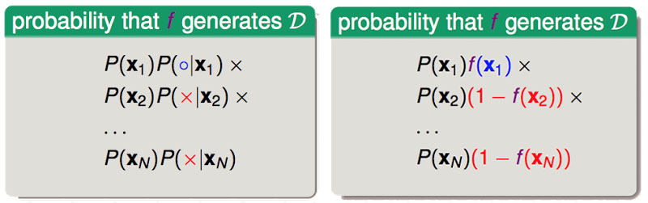
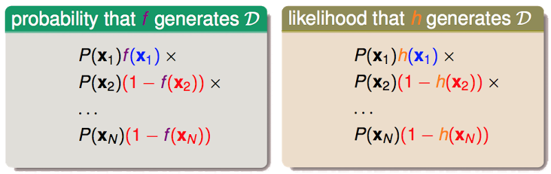

# Logistic Regression

binary classification: $$\text{ideal }f(x) = sign(P(+1|x) - \frac{1}{2}) \in \{-1, +1\}$$

'soft' binary classification: $$f(x) = P(+1|x) \in [0, 1]$$

與一般的 binary classification 的問題不同, 今天想知道的是這 binary 結果發生的機率各是多少? 但依據在我們手上有的資料其實跟以往在解 binary classification 並無不同, 所以我們並不知曉這未知的機率, 我們僅有的是對某次 sample 到的 **x** 去計算出來的 y 各是多少, 所以從想像上這 N 次 Sample 的結果 y 其實是隱含著雜訊的資料 (預期是機率會落在 0~1 的 $$\mathbb{R}$$, 但實際觀察到的僅是該次確切的結果, 是否為 +1)。

## Step 1
先用與 Linear Regression 相同的方法, 用特徵值去計算取出一個分數
$$
\color{purple}{s}=\sum_{i=\color{red}{0}}^d\color{orange}{w_i}{x_i}=w^Tx
$$
## Step 2 (Define Hypothesis Set)
然後要如何將這個分數轉換成 $$\in [0, 1]$$, 我們就想像分數愈高機率就愈大吧! 所以這邊製造了一個函數 logistic function $$\theta(s)$$ 將 $$[-\infty,+\infty]$$ 轉換到 [0, 1]
$$
\color{blue}{\theta}(\color{purple}{s})=\frac{e^\color{purple}{s}}{1+e^\color{purple}{s}}=\frac{1}{1+e^\color{purple}{-s}}
$$

這個函數有底下幾個關鍵值(特性)
* s = 0, $$\theta(0) = \frac{1}{2}$$
* s = $$\infty$$, $$\theta(\infty) = 1$$
* s = $$-\infty$$, $$\theta(-\infty) = 0$$

這是一個 smooth(平滑, 可微), monotonic(單調, 嚴格遞增), sigmoid (S形) 的函數, 到這裡透過 Combine Ste.1 & Step.2 我們已經設計出了一個符合 logistic regression 問題的 Hypothesis Set (**logistic hypothsis**)

$$h(x) = \frac{1}{1+exp(-W^\intercal x)}$$

> 若今天拿這個 hypothesis 去解原來設定的 binary classification 問題 $$sign(P(+1|x) - \frac{1}{2}) \in \{-1, +1\}$$, 則會發現等同於在解 $$sign(w^\intercal x) \in \{-1, +1\}$$ (因為取決於 $$w^\intercal x$$ 是否大於 0, 只是相同問題表現的不同方式而已)。

## Step 3 (Define Error Measure)

從上圖可以知道, Binary Classification、Linear Regression and Logistic Regression 都是透過特徵向量(權重) 與 Input 的特徵值 內積做計算, 但在這之後三者做的動作有些差異如下, **Binary Classification** 會通過一個 sign 函數將 >0 的值給予 +1, <0 的值給予 -1 (所以有一個階梯式的形狀表示), **Linear Regression** 則是將計算出來的值直接輸出, **Logistic Regression** 則是透過一個 sigmoid function 將值轉換到 [0,1], 前兩種方式各自有不同的 Error Measure, 這邊將介紹第三種 err 如何去定義。

$$
\color{purple}{f}(x)=\color{orange}{P(}\color{blue}{+1}\color{orange}{|x)} \Leftrightarrow \color{orange}{P(y|x)}=
\left\{\begin{matrix}
\color{purple}{f}\color{blue}{(x)} & \color{blue}{\text{for } y=+1}\\\
\color{red}{1-}\color{purple}{f}\color{red}{(x)} & \color{red}{\text{for }y=-1}
\end{matrix}\right.
$$

透過以上關係式, 考慮今天訓練樣本的資料 Pattern 為 $$\mathcal{D}=\{(x_1,\color{blue}{+1}),(x_2,\color{red}{-1}),...,(x_N,\color{red}{-1})\}$$ 時 (實際上每個 pair 的第二項 output y 可能為各種排列組合, 但今天先考慮例子中的這種), 假設今天存在 f 可以產生這樣的 Pattern (型態), 那出現的機率是多少呢? (機率如下圖 左, 經由上面關係式可由 f 取代, 如下圖 右)

而因為 f 是我們假定存在的理想 target function, 所以用 f 產生這樣 pattern 的機率通常應該要很大 (運氣好的話), 但今天 f 是未知, 我們有的是一些 hypothesis, 所以我們試著用 h 取代 f 可以得到下圖的關係, 代表 h 也產生相同 pattern 的可能性 - likelihood(h)。

今天 error measure 要衡量的 h 夠不夠接近我們理想的 f, 所以當今天 h 如果夠接近 f 的話, 他們產生出相同 pattern 的機率也就要更相似, 所以我們最後得到的結論

$$\text{if } \color{orange}{h}\approx\color{purple}{f}\text{, then }\; likelihood(\color{orange}{h})\approx(\text{probability using }\color{purple}{f})\approx\color{purple}{\text{large}}$$

我們要如何從 Hypothesis Set 中找到適當的 g 來代表 f, 就是挑選可能性最高的

$$g=\underset{\color{orange}{h}}{argmax}\;likelihood(\color{orange}{h})$$

當 h 是 logistic function $$\theta(w^Tx)$$, 其函數從圖上可知具有對稱性: 1-h(x) = h(-x), 將對稱性的關係式帶入化簡可得到
> 灰色部分對所有的 h 來說都是相同的, 故在挑選 g 時可以省略不看, 另外以 $$y_nx_n$$ 可以表示出 output 不管今天是 sample 到 +1 或是 -1 的 case。

$$
\begin{aligned}
likelihood(\color{orange}{h})&=\color{grey}{P(x_1)}\color{orange}{h}\color{blue}{(x_1)}\color{grey}{\times P(x_2)}\color{red}{(1-\color{orange}{h}(x_2))}\color{grey}{\times ...\times P(x_N)}\color{red}{(1-\color{orange}{h}(x_N))} \\\
&= \color{grey}{P(x_1)}\color{orange}{h}\color{blue}{(x_1)}\color{grey}{\times P(x_2)}\color{red}{(\color{orange}{h}(-x_2))}\color{grey}{\times ...\times P(x_N)}\color{red}{(\color{orange}{h}(-x_N))} \\\
&= \color{grey}{P(x_1)}\color{orange}{h}\color{blue}{(x_1)}\color{grey}{\times P(x_2)}\color{red}{(\color{orange}{h}(y_2x_2))}\color{grey}{\times ...\times P(x_N)}\color{red}{(\color{orange}{h}(y_Nx_N))}
\end{aligned}
$$
目標 g
$$
\underset{\color{orange}{h}}{max}\;\;\color{grey}{likelihood(logistic\;\color{orange}{h}) \propto}\prod_{n=1}^{N}\color{orange}{h}(y_nx_n)
$$將 h 以 logistic function 的形式代回去 (取 ln 把 連乘 替換成 連加)
$$
\begin{aligned}
\underset{\color{orange}{w}}{max}\;\;\color{grey}{likelihood(\color{orange}{w})} &\propto\prod_{n=1}^{N}\theta(y_n\color{orange}{w}^Tx_n) \\\
&\propto ln\prod_{n=1}^{N}\theta(y_n\color{orange}{w}^Tx_n) \\\
&\propto \color{grey}{\frac{1}{N}}\sum_{n=1}^{N}ln\,\theta(y_n\color{orange}{w}^Tx_n)
\end{aligned}
$$
> $$\frac{1}{N}$$ 是額外加上去的, 本身只是常數的 sacling 不影響關係式, 用意在於最後可以整理成我們常見的 Error Measure ($$E_{in}$$) 的長相。

解上式的最大值相當於求下式的最小值
$$
\begin{aligned}
&\;\;\;\;\underset{\color{orange}{w}}{min}\;\color{grey}{\frac{1}{N}}\sum_{n=1}^{N}-ln\,\theta(y_n\color{orange}{w}^Tx_n) \\\
&\Rightarrow \underset{\color{orange}{w}}{min}\;\color{grey}{\frac{1}{N}}\sum_{n=1}^{N}ln(1+exp(-y_n\color{orange}{w}^Tx_n))
\end{aligned}
$$
Pointwise(針對個別資料 $$x_n、y_n$$) 的 Error Measure 形式如下 (因歷史原因, 又另稱 cross-entropy error)
$$
err(\color{orange}{w},x,y)=ln(1+exp(-y\color{orange}{w}^Tx))\\\
\color{blue}{\text{cross-entropy error}}
$$$$E_{in}(w)$$ 的衡量式則是
$$
\color{grey}{\frac{1}{N}}\sum_{n=1}^{N}ln(1+exp(-y_n\color{orange}{w}^Tx_n))
$$
## Step 4 (Minimizing $$E_{in}(w)$$)
如同之前的 linear regression 這邊定義的 $$E_{in}$$ 也是連續(continuous)、可微(differentiable)、向下凸(convex) 函數。