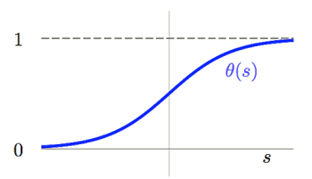
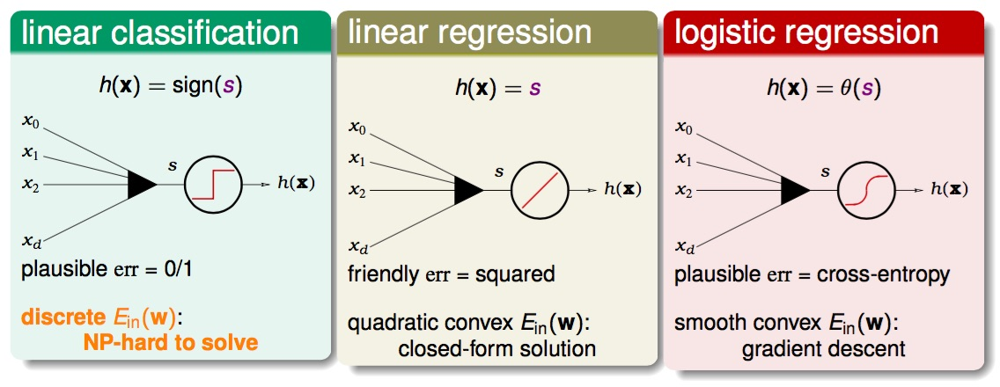

# Logistic Regression

binary classification: $$\text{ideal }f(x) = sign(P(+1|x) - \frac{1}{2}) \in \{-1, +1\}$$

'soft' binary classification: $$f(x) = P(+1|x) \in [0, 1]$$

與一般的 binary classification 的問題不同, 今天想知道的是這 binary 結果發生的機率各是多少? 但依據在我們手上有的資料其實跟以往在解 binary classification 並無不同, 所以我們並不知曉這未知的機率, 我們僅有的是對某次 sample 到的 **x** 去計算出來的 y 各是多少, 所以從想像上這 N 次 Sample 的結果 y 其實是隱含著雜訊的資料 (預期是落在 0~1 的 $$\mathbb{R}$$, 但實際觀察到的僅是確切的結果 是否為 +1)。

## Step 1
先用與 Linear Regression 相同的方法, 用特徵值去計算取出一個分數
$$
\color{purple}{s}=\sum_{i=\color{red}{0}}^d\color{orange}{w_i}{x_i}=w^Tx
$$
## Step 2
然後要如何將這個分數轉換成 $$\in [0, 1]$$, 我們就想像分數愈高機率就愈大吧! 所以這邊製造了一個函數 logistic function $$\theta(s)$$ 將 $$[-\infty,+\infty]$$ 轉換到 [0, 1]
$$
\color{blue}{\theta}(\color{purple}{s})=\frac{e^\color{purple}{s}}{1+e^\color{purple}{s}}=\frac{1}{1+e^\color{purple}{-s}}
$$

這個函數有底下幾個關鍵值(特性)
* s = 0, $$\theta(0) = \frac{1}{2}$$
* s = $$\infty$$, $$\theta(\infty) = 1$$
* s = $$-\infty$$, $$\theta(-\infty) = 0$$

這是一個 smooth(平滑, 可微), monotonic(單調, 嚴格遞增), sigmoid (S形) 的函數, 到這裡透過 Combine Ste.1 & Step.2 我們已經設計出了一個符合 logistic regression 問題的 Hypothesis Set (**logistic hypothsis**)

$$h(x) = \frac{1}{1+exp(-W^\intercal x)}$$

> 若今天拿這個 hypothesis 去解原來設定的 binary classification 問題 $$sign(P(+1|x) - \frac{1}{2}) \in \{-1, +1\}$$, 則會發現等同於在解 $$sign(w^\intercal x) \in \{-1, +1\}$$ (因為取決於 $$w^\intercal x$$ 是否大於 0, 只是相同問題表現的不同方式而已)。

## Step 3

從上圖可以知道, Binary Classification、Linear Regression and Logistic Regression 都是透過特徵向量(權重) 與 Input 的特徵值 內積做計算, 但在這之後三者做的動作有些差異如下, **Binary Classification** 會通過一個 sign 函數將 >0 的值給予 +1, <0 的值給予 -1 (所以有一個階梯式的形狀表示), **Linear Regression** 則是將計算出來的值直接輸出, **Logistic Regression** 則是透過一個 sigmoid function 將值轉換到 [0,1], 前兩種方式各自有不同的 Error Measure, 這邊將介紹第三種 err 如何去定義。

當 y 是已知時, 回推 P(y|**x**)
$$
\color{purple}{f}(x)=\color{orange}{P(}\color{blue}{+1}\color{orange}{|x)} \Leftrightarrow \color{orange}{P(y|x)}=
\left\{\begin{matrix}
\color{purple}{f}\color{blue}{(x)} & \color{blue}{\text{for } y=+1}\\\
\color{red}{1-}\color{purple}{f}\color{red}{(x)} & \color{red}{\text{for }y=-1}
\end{matrix}\right.
$$